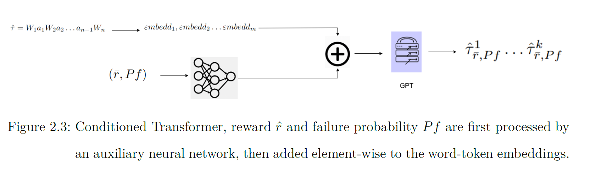
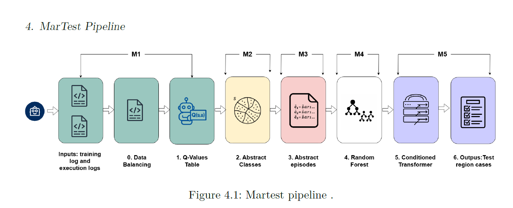

# Martest-pipeline

This repository is the implementation of the [Testing Reinforcment Learning using NLP techniques](https://repositorio.uniandes.edu.co/entities/publication/80630919-0cd4-42bf-a52a-9b6803ac4209) and this is based in how we can test reinforcement learning agents using a network (conditioned transformer) usually used in problems of natural language processing. 

Basically, in this type of testing we take the agent's logs of paths that took the agent in his own deployment and we take these for training of the network (conditioned transformer) with the goal of find scenarios where the agent may could fail. This type of testing is described as **Data Testing** a type of testing where you don't know the code or architecture of the system and only you need data of the system's performance. 

The idea of the **Conditioned transformer** is that the network learn the paths,rewards and other objective's functions that you define for then with the appropiate settings to predict failure scenarios. You can see the architecture of the conditioned transformer here: 

As you can observe the conditioned is composed by a network and GPT transformer components, these are programming with transformers library from Huggin Face and are training end to end jointly. 

## MarTest: An NLP Approach for test sequence generation

Sometimes the state space of the agents is infinite and continous, and the conditioned transformer (as almost all or all NLP models) works with "finite sequences" we need therefore some idea for join both worlds, we based this idea in a math concept called "abtract classes" or for this case "abstract states" and with this we can generate the input for the conditioned transformer. We deal with this in the first four modules: 

- 1_q_values_tables
- 2_abstract_classe
- 3_abstrct_episodes
- 4_random_forest

And in the five module we train the conditioned transformer, you can see this in the next figure: 

For more information you can read this [here](https://repositorio.uniandes.edu.co/entities/publication/80630919-0cd4-42bf-a52a-9b6803ac4209)

